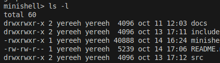
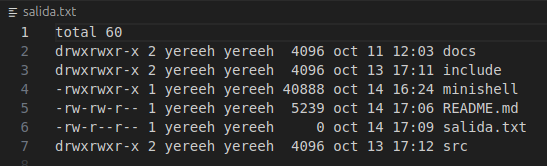
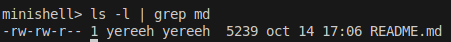
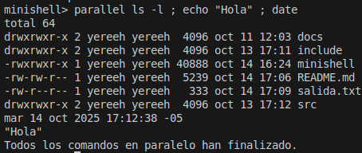
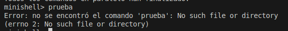

# Mini Shell Linux

Este proyecto es una implementación de un mini shell basica en C++ para Linux, que soporta ejecución de comandos, redirección de salida, tuberías y ejecución en paralelo.

# Requerimientos

- Sistema operativo Linux
- Compilador g++ (C++11 o superior)
- Librería POSIX (incluida en sistemas Linux)
- Librería pthread (generalmente incluida en Linux)


## Funciones POSIX utilizadas


El proyecto hace uso de varias funciones POSIX para la gestión de procesos, archivos y comunicación entre procesos. Algunas de las principales funciones utilizadas son:

- `fork()`: Crea un nuevo proceso hijo duplicando el proceso actual.
- `execvp()`: Ejecuta un programa, reemplazando el proceso actual; busca el ejecutable en el PATH.
- `execv()`: Ejecuta un programa, reemplazando el proceso actual; requiere la ruta exacta del ejecutable.
- `pipe()`: Crea un canal de comunicación (tubería) entre procesos.
- `dup2()`: Redirige descriptores de archivos, útil para redirección de entrada/salida.
- `open()`: Abre archivos y retorna un descriptor de archivo.
- `close()`: Cierra descriptores de archivos abiertos.
- `wait()`: Espera a que termine un proceso hijo.
- `waitpid()`: Espera a que termine un proceso hijo específico.
- `pthread_create()`: Crea un nuevo hilo de ejecución.
- `pthread_join()`: Espera a que un hilo termine su ejecución.
- `perror()`: Muestra mensajes de error relacionados con llamadas al sistema.
- `errno`: Variable global que almacena el código de error de la última llamada al sistema.

Estas funciones permiten la ejecución de comandos, manejo de redirecciones, tuberías y ejecución en paralelo, siguiendo el estándar POSIX para sistemas tipo Unix/Linux.

## Características principales

| Característica                | Implementada | Descripción                                                      |
|-------------------------------|:------------:|------------------------------------------------------------------|
| Ejecución de comandos         |      ✔️      | Comandos estándar y rutas absolutas                              |
| Redirección de salida (`>`)   |      ✔️      | Redirige salida estándar a archivo                               |
| Tuberías simples (`\|`)        |      ✔️      | Conecta salida de un comando con entrada de otro                 |
| Ejecución en paralelo (`parallel cmd1 ; cmd2 ; ...`)   |      ✔️      | Ejecuta varios comandos en paralelo usando hilos                 |
| Manejo de errores             |      ✔️      | Mensajes claros con códigos de error (`errno`)                   |
| Combinación tubería/redirección|      ❌      | No soportado: `cmd1 | cmd2 > archivo`                           |


## Estructura del proyecto

```
mini-shell-linux/
├── include/
│   └── ejecutador.h
├── src/
│   ├── ejecutador.cpp
│   ├── rutas.cpp
│   ├── redireccion.cpp
│   ├── tuberia.cpp
│   ├── paralelo.cpp
│   └── main.cpp
├── README.md
```

## Compilación

Desde la raíz del proyecto:

```bash
g++ src/*.cpp -Iinclude -o minishell
```

## Uso básico

```bash
./minishell
```

## Casos de prueba y ejemplos de uso

### 1. Ejecutar comando
```bash
minishell> ls -l
```


### 2. Redirigir salida
```bash
minishell> ls -l > salida.txt
cat salida.txt
```


### 3. Usar tubería
```bash
minishell> ls -l | grep md
```


### 4. Ejecutar en paralelo
```bash
minishell> parallel ls -l ; echo "Hola" ; date
```


### 5. Error por comando no encontrado
```bash
minishell> comando_inexistente
```


## Archivos principales

- `main.cpp`: Entrada principal, bucle de lectura de comandos.
- `ejecutador.cpp`: Lógica de ejecución de comandos y parseo.
- `rutas.cpp`: Ejecución de comandos con validación de rutas y permisos.
- `redireccion.cpp`: Implementación de la redirección de salida estándar.
- `tuberia.cpp`: Implementación de tuberías entre dos comandos.
- `paralelo.cpp`: Ejecución de comandos en paralelo usando hilos.
- `ejecutador.h`: Declaraciones de funciones principales.

## Notas

- El shell solo soporta tuberías simples (`cmd1 | cmd2`).
- La redirección de salida y las tuberías no pueden combinarse en una sola línea (limitación actual).
- La redirección de salida y las tuberías no pueden combinarse en una sola línea (limitación actual).
  Ejemplo de comando NO soportado:
  ```
  minishell> ls -l | grep cpp > salida.txt
  ```
  En este caso, no es posible redirigir la salida de una tubería a un archivo directamente.
- Los comandos se buscan en `/bin` si no se da una ruta absoluta.
- Los errores muestran el código `errno` y su descripción para facilitar el diagnóstico.

## Autor
Jheral Jhosue Maquera Laque

Alex Yasmani Huaracha Bellido

